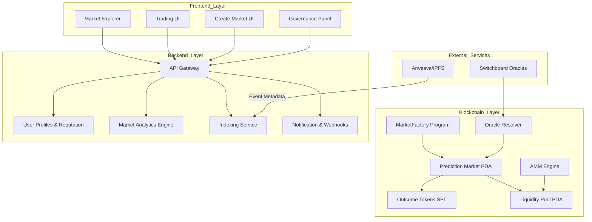

# InsightCast
Forecasting today is centralized, biased, and easily manipulated. Organizations and communities rely on limited or unreliable data to make decisions, leading to financial loss, misinformation, and poor planning.

### Description
InsightCast introduces a transparent, decentralized forecasting marketplace transforms real-world events into tradable prediction markets. Users create markets, add liquidity, trade outcomes, and earn from accurate forecasts — all secured by verifiable smart contracts and oracle data.


---
## ✨ Key Features

- **Multi-Outcome Markets:** support 3+ outcomes (e.g., "BTC price range", "Election with candidates", "Sports score predictions").
- **Automated Market Maker (AMM) for Prediction Shares:** A custom bonding curve for pricing YES/NO shares dynamically.
- **Reputation System:** Users gain rating when predictions are correct. Increases their market limits and gives badges.
- **Proof-of-Resolution Oracle Layer:** Uses Switchboard + fallback community voting.
- **Governance Layer:** Community votes on: disputed outcomes, oracle provider set, new market categories
- **Referral and Affiliate System:** Track who brought new market creators/participants.
  
---

### Workflow

1. **Market Creation**
   - A user proposes a forecasting event with multiple outcomes (e.g., “ETH TVL by Q3”).
   - Smart contract creates outcome tokens.

2. **Liquidity Provision**
   - Market makers add funds → AMM sets initial prices based on liquidity.
   - Ensures legitimacy and accurate metadata.

3. **Trading & Forecasting**
   - Users buy/sell outcome shares representing probabilities.
   - Reduces total supply and logs impact transparently.

4. **Resolution & Payout**
   - Switchboard oracle fetches the real result.
   - If oracle fails → DAO governance votes. Winning outcome holders receive proportional rewards.
---

## 🧩 Tech Stack
| Layer             | Technologies                                 |
| ----------------- | -------------------------------------------- |
| **Smart Contracts:**      | Anchor, Rust, Solana SPL Tokens |
| **Frontend**       | Next.js 15, TypeScript, Tailwind, Zustand   |
| **Backend**    | Nestjs + MongoDB   |
| **Oracle** | Switchboard |

---

## 🔄 System Architecture

## 🏗️ Project Structure

```
insightcast/
├── prediction-market-smartcontract/              # Solana smart contracts (Anchor)
│   ├── programs/
│   │   └── prediction/
│   │       ├── src/
│   │       │   ├── instructions/
│   │       │   ├── states/
│   │       │   ├── constants.rs
│   │       │   ├── errors.rs
│   │       │   ├── events.rs
│   │       │   ├── utils.rs
│   │       └── Cargo.toml
│   ├── Anchor.toml
│   ├── Cargo.lock
│   ├── tests/
│   │   ├── const.ts
│   │   ├── prediction.ts
│   │   └── utils.ts
│   └── README.md
│
├── backend/                   # NestJS Backend
│   ├── src/
│   │   ├── controller/
│   │   │   ├── bot/
│   │   │   │   └── index.ts
│   │   │   ├── utils.ts
│   │   │   ├── initialize/
│   │   │   │   └── index.ts
│   │   │   ├── market/
│   │   │   │   ├── index.ts
│   │   │   │   └── utils.ts
│   │   │   ├── oracle/
│   │   │   │   └── index.ts
│   │   │   ├── profile/
│   │   │   │   └── index.ts
│   │   │   ├── referral/
│   │   │   │   └── index.ts
│   │   │   └── index.ts
│   │   │
│   │   ├── middleware/
│   │   │   └── proposeValidator.ts
│   │   │
│   │   ├── model/
│   │   │   └── (NestJS Mongoose/Prisma Models Here)
│   │   │
│   │   ├── oracle_service/
│   │   │   └── simulateFeed.ts
│   │   │
│   │   ├── prediction_market_sdk/
│   │   │   ├── idl/
│   │   │   ├── config.ts
│   │   │   ├── constants.ts
│   │   │   ├── event.ts
│   │   │   ├── index.ts
│   │   │   └── util.ts
│   │   │
│   │   ├── router/
│   │   │   ├── market/
│   │   │   │   └── index.ts
│   │   │   ├── oracle/
│   │   │   ├── profile/
│   │   │   │   └── index.ts
│   │   │   ├── referral/
│   │   │   │   └── index.ts
│   │   │   └── index.ts
│   │   │
│   │   ├── type/
│   │   │   └── index.ts
│   │   ├── config.ts
│   │   ├── index.ts      
│   │   └── prediction.json
│   │
│   ├── package.json
│   ├── .env.example
│   ├── readme.md           
│   └── tsconfig.json
│
├── frontend/                  # Next.js Frontend
│   ├── public/
│   ├── src/
│   │   ├── app/
│   │   ├── components/
│   │   ├── oracle_service/
│   │   │   └── simulateFeed.ts
│   │   ├── prediction_market_sdk/
│   │   │   ├── idl.ts
│   │   │   ├── constants.ts
│   │   │   ├── util.ts
│   │   └── data/
│   ├── pages/
│   ├── styles/
│   ├── types/
│   ├── utils/
│   ├── next.config.ts
│   ├── package.json
│   └── README.md
│
└── docs/                                        # Documentation 
    ├── architecture.md
    ├── oracle.md
    ├── sdk_usage.md
    └── api_reference.md

```
---
